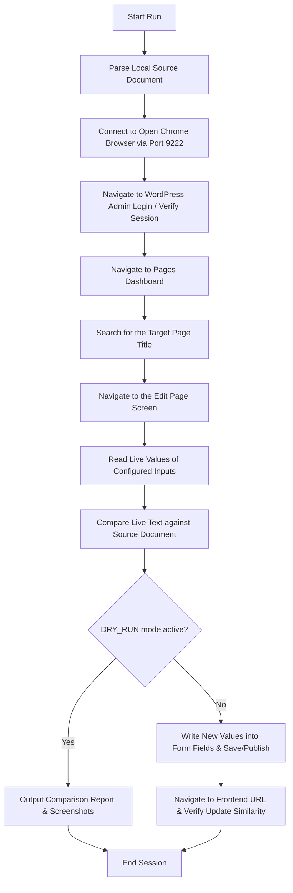

# Playwright JavaScript Generic Content Update & Verification Plan

This document explains the overall design, motto, and step-by-step execution flow of the Playwright JavaScript browser automation engine.

---

## 1. The Motto & Objective

The primary goal of this script is to **verify and synchronize content between a local document source and any WordPress page editing fields (ACF or Classic/Gutenberg inputs) using headed browser automation.**

### **Key Benefits:**
1.  **Firewall & Bot Bypass (CDP):** By connecting to an active, real Chrome browser instance with your user profile, the script **bypasses Cloudflare, Wordfence, and All In One WP Security bans**.
2.  **No Saving in Verification Mode:** It allows you to run safe cross-comparisons (Dry Runs) to view differences before committing edits to the database.
3.  **Resilience:** It maps fields via robust CSS selectors or label-based target lookups, making it highly adaptive to WordPress theme updates.

---

## 2. Step-by-Step Generic Workflow

Here is how the script operates from start to finish for **any** WordPress page:

### **Step 1: Read the Source Content**
*   The script reads a local text/markdown file containing the expected page text. It parses this file into key-value pairs (e.g. `Banner Title`, `Section Description`).

### **Step 2: Connect to Chrome in Headed Mode**
*   Rather than launching a blank background browser, Playwright connects to your **existing open Chrome browser window** via a remote debugging connection (port 9222).
*   > [!IMPORTANT]
    > **To see the browser actions live on your screen**, simply bring your open Chrome browser window to the foreground after launching the script. The script runs inside a new tab in your existing Chrome browser!

### **Step 3: Access WordPress Page Editor**
*   It navigates to the WordPress pages section, searches for your configured page title, and opens the page editing interface.

### **Step 4: Read and Verify Content**
*   The script scans every configured text field, text area, and selection dropdown in the editor.
*   It performs a word-by-word similarity check between the editor content and your source document, ignoring HTML formatting tags (like decoding `&amp;` to `&`).

### **Step 5: Write Changes (If Dry Run is Disabled)**
*   If any fields are out of sync:
    *   **In DRY_RUN mode:** It records the differences and outputs a verification report.
    *   **In LIVE mode:** It inputs the updated text into the fields, clicks "Update/Publish", and validates that the frontend website displays the new text.

---

## 3. Configuration & Workspace Architecture

To target a new page or different fields, you only need to configure these generic files:

*   **`config.js`**: Defines the WordPress login URL, credentials, target page search term, frontend URL, and a dictionary of selectors mapping your document headings to WordPress field IDs.
*   **`.env`**: Stores secret configuration values (username, password, dry-run toggles).
*   **`content.md`**: Contains the source text template mapped by section names.
*   **`automation.js`**: Core script handling page searches, edits, saves, and frontend comparison.
*   **`verify_fields.js`**: Light-weight script designed specifically to run headed verification checks.
